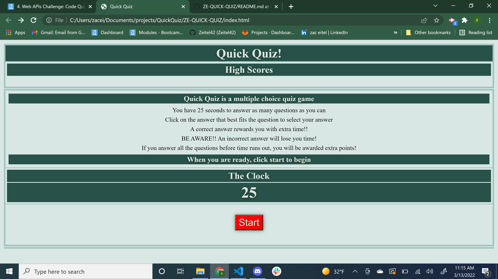

# ZE-QUICK-QUIZ

## Purpose
* A 25 second quiz with a timer that adds or subtracts time based on correct or incorrect answers respectively
* player clicks start button to begin quiz
* A correct answer adds 3 seconds 
* An incorrect answer subtracts 5 seconds
* If player answers all questions before time expires they are rewarded extra points
* Player can enter initials and save score to localStorage

## Built With
HTML, CSS, JavaScript

# Website
https://zeitel42.github.io/ZE-QUICK-QUIZ/

## Contributions made by Zeitel42 
